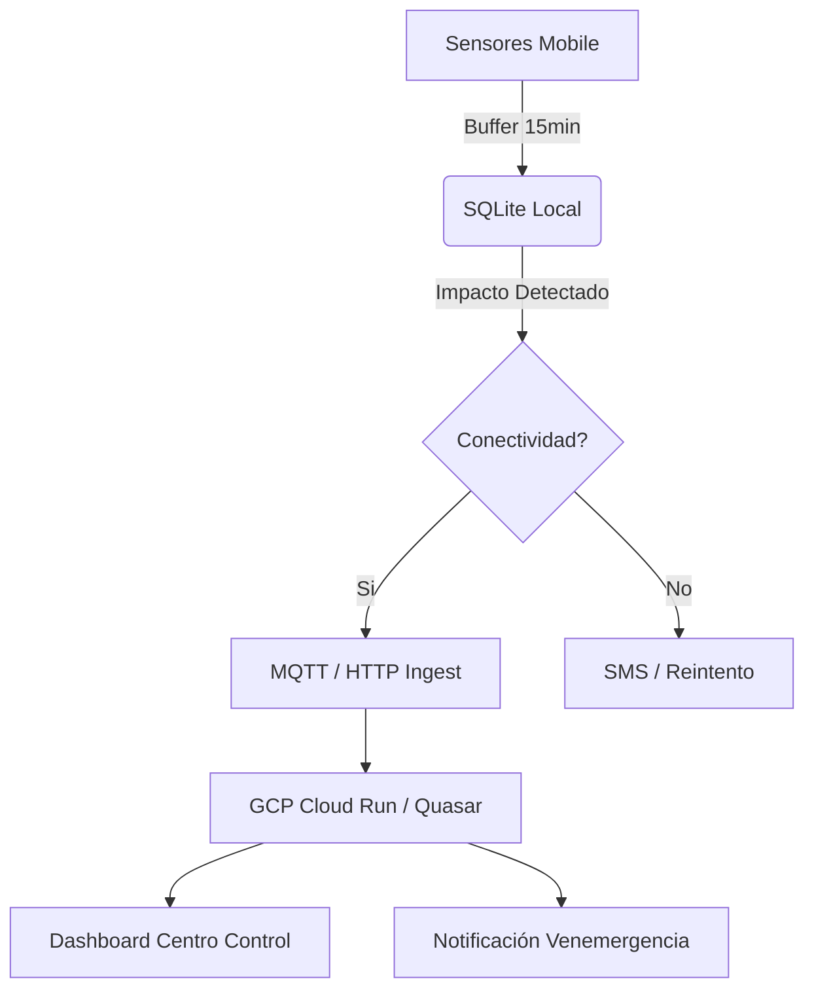
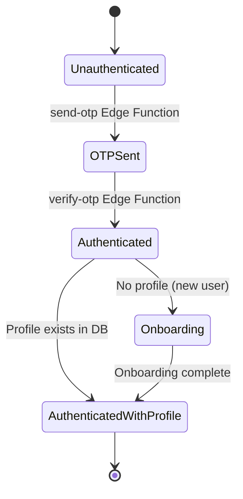

# CLAUDE.md

This file provides guidance to Claude Code (claude.ai/code) when working with code in this repository.

## 1. Project Overview

RuedaSeguro is a B2B2C InsurTech platform for Venezuelan motorcycle micro-insurance (RCV), backed by Mercantil Seguros.

- **`mobile/`** — Flutter app (end-user, Spanish locale `es_VE`)
- **`supabase/`** — PostgreSQL schema, migrations, and Deno Edge Functions
- **`docs/`** — Canonical documentation (PRODUCT_PLAN, ARCHITECTURE, etc.)

## 2. Commands

### Mobile (Flutter)

Run from the `mobile/` directory:

```bash
flutter pub get          # Install dependencies
flutter analyze          # Lint
flutter test             # Run all tests
flutter test --coverage  # Run tests with coverage report
flutter test test/path/to/file_test.dart   # Run a single test file
flutter build apk --flavor dev             # Build dev APK
flutter build apk --flavor staging         # Build staging APK
flutter build apk --flavor production      # Build release APK
```

### Supabase

```bash
supabase start                          # Start local Supabase (Docker)
supabase db push --project-ref <ref>    # Apply migrations to remote
supabase functions serve                # Serve Edge Functions locally
supabase functions deploy <name>        # Deploy a specific Edge Function
supabase secrets set KEY=value          # Set Edge Function secret
```

## 3. Architecture

### 3.1 Pipeline Telemetría (Mermaid)



### 3.2 Auth Flow (Mermaid)



### 3.3 Feature Modules (Flutter)

Code is organized by feature under `mobile/lib/features/`:
`data/` (Repos), `domain/` (Models/State), `presentation/` (Screens/Providers), `services/` (Specific logic).

## 4. Engineering Practices

### 4.1 Git Workflow & Commits

- **Conventional Commits:** `feat:`, `fix:`, `chore:`, `docs:`, `test:`, `refactor:`.
- **Branching:** `main` is protected. Use `feat/RS-XXX-description` or `fix/RS-XXX-description`.
- **Surgical Changes:** Touch only what you must. Clean up only your own mess. Match existing style. Every changed line should trace directly to the request.

### 4.2 Definition of Done (DoD) & Goal-Driven Execution

- **Reproduce First:** For bug fixes, write a test that reproduces the failure before fixing it.
- **Verification Loop:** Define success criteria (e.g., "Write tests for invalid inputs, then make them pass").
- [ ] Code passes `flutter analyze`.
- [ ] New/Modified logic has unit/widget tests.
- [ ] No regression in existing tests (`flutter test`).
- [ ] PII (Personal Identifiable Information) is never logged or leaked.

### 4.3 Simplicity First

- **Minimum code** that solves the problem. No speculative features or abstractions for single-use code.
- If 200 lines can be 50, rewrite it.

### 4.4 Migration Rules

- **Naming:** `RS-XXX_description_in_snake_case.sql`. IDs start at `RS-200` post-baseline (IDs <200 are archived history).
- **One change per file:** Do not mix a new table with an ALTER on another table in the same migration.
- **Additive only:** Migrations must not drop columns or tables without a documented plan. Breaking changes require a deprecation migration first.
- **RLS required:** Every table that holds user data must have RLS enabled and policies defined in the same migration.
- **Document rollback:** Add a `-- DOWN:` comment block at the top of each migration describing how to reverse it, even if reversal is manual.
- **Never edit applied migrations.** If a migration has been pushed to any environment, it is immutable. Create a new one.

### 4.5 Secret Handling

- **Never commit secrets.** `.env`, `.env.*`, `key.properties`, and `*.jks` are in `.gitignore`. Verify before every commit.
- **Flutter secrets** go in `.env.dev` / `.env.staging` / `.env.production` and are passed via `--dart-define-from-file`. Never hardcode in Dart.
- **Edge Function secrets** are set via `supabase secrets set` and read with `Deno.env.get()`. They are never stored in this repo.
- **CI secrets** live in GitHub Environments (Develop / Staging / Production). See classification in `docs/OPERATIONS.md`.
- **If a secret is accidentally committed:** rotate it immediately, then remove it from history with `git filter-repo`. Do not force-push without notifying the team.

## 5. AI Agent Rules

### 5.1 Karpathy Protocol (Think Before Coding)

- **Don't assume.** State assumptions explicitly. If uncertain, ASK.
- **Surface tradeoffs.** If multiple interpretations exist, present them before picking.
- **Stop on confusion.** If something is unclear, name it and ask for clarification.

### 5.2 Implementation Rules

- **Spanish First:** User-facing strings MUST be in Spanish (`es_VE`).
- **Riverpod Only:** Use `Notifier` or `AsyncNotifier`. Avoid `ChangeNotifier`.
- **Verify Always:** Run `flutter analyze` and `flutter test` after every implementation.
- **Clean orphans:** Remove imports/variables/functions that YOUR changes made unused. Do not touch pre-existing dead code.

### 5.3 What Not To Do

- Do not run `supabase db reset`, `git reset --hard`, or `DROP TABLE` without explicit user confirmation.
- Do not modify migrations that have already been applied to any environment.
- Do not add speculative code, TODOs, or "future-proof" abstractions.
- Do not log PII (cédulas, nombres, teléfonos, plates) anywhere — not in Sentry, not in console.

### 5.4 GitHub CLI (`gh`)

`gh` is available and should be used for all GitHub operations in this repo (PRs, issues, reviews, releases). Use it via the `Bash` tool.

**Allowed freely:**

- Read operations: `gh pr list`, `gh pr view`, `gh issue list`, `gh issue view`, `gh run list`, `gh run view`, `gh repo view`
- Creating PRs and issues: `gh pr create`, `gh issue create`
- Adding comments: `gh pr comment`, `gh issue comment`

**Requires explicit confirmation before executing — always state the command and reason first:**

- `gh pr merge` — merging a PR cannot be undone in shared history
- `gh pr close` / `gh issue close` — closing discards review context
- `gh release create` — publishes a release tag publicly
- `gh repo delete` — destructive and irreversible
- Any `gh api` call that writes or deletes data

**Format for destructive-action requests:**

> I'm about to run: `gh pr merge 42 --squash`
> Reason: PR 42 passed all checks and is approved.
> This will squash-merge the branch into `main` and close the PR. Confirm?

Wait for explicit confirmation before proceeding.

## 6. Skill / Tooling Routing

### 6.1 Full Routing Rules (gstack)

| Skill                  | When to invoke                                                 |
| ---------------------- | -------------------------------------------------------------- |
| `/office-hours`        | Product ideas, "is this worth building", brainstorming         |
| `/plan-ceo-review`     | Strategy, scope, "think bigger", "what should we build"        |
| `/plan-eng-review`     | Architecture, "does this design make sense", new tables/APIs   |
| `/design-consultation` | Design system, brand, "how should this look"                   |
| `/plan-design-review`  | Design review of a plan                                        |
| `/plan-devex-review`   | Developer experience of a plan                                 |
| `/autoplan`            | "Review everything", full review pipeline                      |
| `/investigate`         | Bugs, errors, "why is this broken", "wtf", "this doesn't work" |
| `/review`              | Code review, check the diff, "look at my changes"              |
| `/cso`                 | Security audit, OWASP, auth/payments/RLS/secrets               |
| `/codex`               | Second opinion, adversarial review of critical code            |
| `/health`              | Code quality dashboard                                         |
| `/ship`                | Ship, deploy, create a PR, "send it"                           |
| `/land-and-deploy`     | Merge + deploy + verify                                        |
| `/document-release`    | Update docs after shipping                                     |
| `/retro`               | Weekly retro, "how'd we do"                                    |
| `/careful`             | Safety mode — before destructive operations                    |
| `/guard`               | `/careful` + `/freeze` combined                                |
| `/freeze <path>`       | Restrict edits to a directory for this session                 |
| `/context-save`        | Save progress, "save my work", end of session >2h              |
| `/context-restore`     | Resume, restore, "where was I"                                 |
| `/learn`               | Review what the agent has learned                              |

### 6.2 Phase Mapping for This Repo

Skills map to our development phases as defined in `docs/RESET_PLAN_2026-04-27.md` Section 8:

| Phase                   | Skills                                                          |
| ----------------------- | --------------------------------------------------------------- |
| A — Ideación/Scoping    | `/office-hours`, `/plan-ceo-review`                             |
| B — Arquitectura/Diseño | `/plan-eng-review` (OBLIGATORIA), `/plan-design-review`, `/cso` |
| C — Implementación      | `/careful`, `/guard`, `/freeze`, `/investigate`                 |
| D — Pre-commit          | `/review` (OBLIGATORIA), `/codex`                               |
| E — Pull Request        | `/cso` (if auth/payments/RLS), `/ship`                          |
| F — Post-merge          | `/document-release`, `/canary`                                  |
| G — Retrospectiva       | `/retro`, `/health`                                             |
| H — Sesión              | `/context-save`, `/context-restore`                             |

### 6.3 Obligation Levels for This Repo

**OBLIGATORIA** — PR cannot merge without this:

| Skill              | When                                                                                 |
| ------------------ | ------------------------------------------------------------------------------------ |
| `/plan-eng-review` | Any new table, API client, or architectural change. Output linked in PR description. |
| `/review`          | Every PR before opening.                                                             |
| `/cso`             | Any PR touching auth, payments, RLS, encryption, or secrets.                         |
| `/investigate`     | Any bugfix PR. Root cause documented, not just symptom fixed.                        |

**RECOMENDADA** — run by default, skip only for trivial changes with justification in PR:

| Skill               | When                                             |
| ------------------- | ------------------------------------------------ |
| `/careful`          | Any session that might run destructive commands. |
| `/office-hours`     | Any non-trivial new feature before planning.     |
| `/document-release` | After every merge to `main`.                     |
| `/retro`            | Every Friday.                                    |
| `/context-save`     | End of any session >2h.                          |

**OPCIONAL** — available when the case warrants it:

| Skill              | When                                                                   |
| ------------------ | ---------------------------------------------------------------------- |
| `/codex`           | Mercantil-facing critical code (carrier API, payment encryption, KYC). |
| `/health`          | Monthly quality snapshot.                                              |
| `/plan-ceo-review` | Scope decisions affecting roadmap.                                     |
| `/autoplan`        | Large epics before Sprint planning.                                    |

**NOT USED** — web/browser-oriented, not applicable to Flutter + Supabase:

`/qa`, `/browse`, `/design-review`, `/design-html`, `/open-gstack-browser`, `/setup-browser-cookies`, `/setup-deploy`, `/benchmark`

## 7. Environment Variables

Three environments: **Develop**, **Staging**, **Production** (GitHub Environments).

### Flutter (dart-define) — from `mobile/.env.<env>`

- `SUPABASE_URL` — Environment Variable per env
- `SUPABASE_ANON_KEY` — Environment Secret per env
- `TURNSTILE_SITE_KEY` — Repository Variable (public key, same across envs)

### CI (GitHub Actions secrets)

- `SUPABASE_API_KEY` — Repository Secret (Supabase CLI personal access token)
- `SUPABASE_PROJECT_ID` — Environment Variable per env (project ref slug)
- `SUPABASE_SERVICE_ROLE_KEY` — Environment Secret per env
- `SENTRY_AUTH_TOKEN` — Repository Secret (upload symbols)

### Edge Functions — set via `supabase secrets set`, never in GitHub

- `WHATSAPP_TOKEN`, `WHATSAPP_PHONE_NUMBER_ID`
- `VERIFICATION_PACKAGE_NAME`, `VERIFICATION_HASH`
- `TURNSTILE_SECRET_KEY`
- `SUPABASE_OTP_DEV_BYPASS` (true in dev, false in staging/prod)

### Supabase Dashboard only

- `MESSAGE_BIRD_API_KEY` (Auth → Providers → Phone)

## 8. Testing

- **Unit/Widget:** `mobile/test/` (Mocktail). Run: `flutter test`.
- **Coverage:** `flutter test --coverage`. CI enforces ≥70% line coverage on new code.
- **Integration/E2E:** Future (Patrol) — Sprint 5+.
- **Rule:** PRs must not decrease overall coverage. CI blocks merge if coverage drops.
