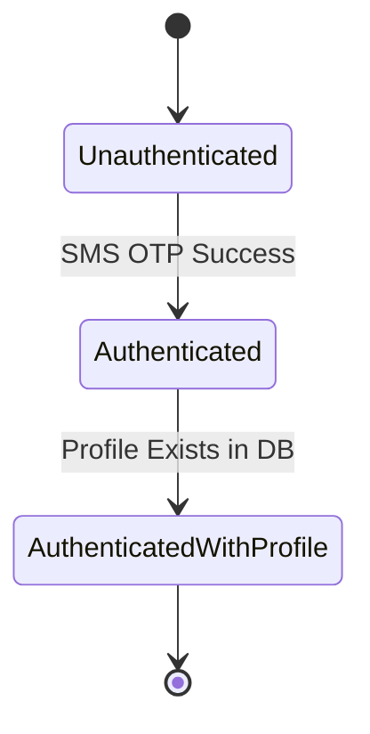
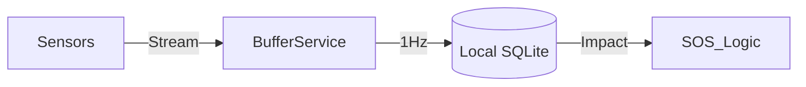

# GEMINI.md

This file provides specialized guidance for the Gemini CLI agent to ensure high-quality, idiomatic, and verified contributions to the RuedaSeguro project.

## 1. Role Definition

**Senior Full-Stack Engineer & Architect** specializing in Flutter (Riverpod), Supabase (PostgreSQL/RLS), and IoT telemetry pipelines.

## 2. Tech Stack & Constraints

- **Mobile:** Flutter (Dart), `flutter_riverpod` (Notifiers only), `go_router`.
- **Backend:** Supabase, Deno Edge Functions, PostgreSQL.
- **Rules:**
  - **No ChangeNotifier:** Always use `Notifier`, `AsyncNotifier`, or `StreamNotifier`.
  - **Spanish Locale:** All user-facing text must be in `es_VE`.
  - **Type Safety:** No `dynamic` where avoidable. Use strong typing and exhaustive switches.
  - **Security:** RLS is mandatory for user data. Never leak `service_role` keys.

## 3. Verification Loop (Mandatory)

Before declaring any task "done", you MUST execute:

1.  **Analyze:** `cd mobile && flutter analyze`
2.  **Test:** `cd mobile && flutter test` (or specific test file)
3.  **Visual Logic:** For complex flows, generate a Mermaid diagram to verify understanding.

## 4. Hierarchical Context (JIT)

For complex modules, refer to these "Just-In-Time" context locations:

- **OCR Logic:** `mobile/lib/features/onboarding/services/ocr_service.dart`
- **Sensor Pipeline:** `mobile/lib/features/telemetry/`
- **Auth Guard:** `mobile/lib/app/router.dart`

## 5. Mermaid Mapping

### Auth Flow

### Sensor Buffer

## 6. Skill Integration (Gemini CLI)

Use these mappings for task-specific excellence:

- **Feature Boilerplate:** Use shell scripts (if available) or standard patterns in `lib/features/`.
- **Database Changes:** Always check `supabase/migrations/` first.
- **Security Audit:** Review RLS policies in `.sql` files when touching data models.

## 7. Operational Mandate (Karpathy Protocol)

### 7.1 Goal-Driven Execution

- **Reproduce First:** For any fix, a failing test MUST exist before the code change.
- **Success Criteria:** State your plan as verifiable steps. Loop until verified.
- **Stop on Confusion:** If a partner API or requirement is unclear, STOP and ask. Don't guess.

### 7.2 Simplicity & Surgicality

- **Minimum Viable Change:** Choose the simplest idiomatic solution over complex abstractions.
- **Match Style:** Adhere strictly to the project's existing coding patterns (Riverpod Notifiers, es_VE strings).
- **Clean Messes:** Remove what your change orphaned; leave everything else alone.

Prioritize **Verification over Speed**. If a test fails, you must fix it or explain why before proceeding.
