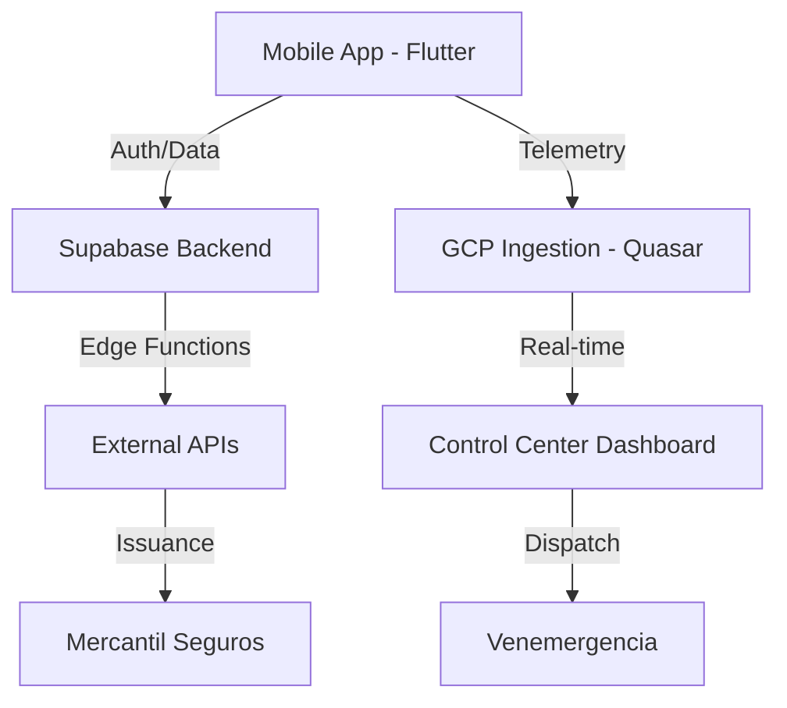

# RuedaSeguro — System Architecture

**Version:** 1.0 (Reset 2026)
**Status:** Canonical Reference

---

## 1. High-Level Overview

RuedaSeguro is a B2B2C InsurTech platform focused on motorcycle riders in Venezuela. The system connects riders with insurance carriers (Mercantil) and assistance networks (Venemergencia) through a real-time telemetry and incident management pipeline.

### 1.1 System Components



---

## 2. Mobile Architecture (Flutter)

Located in `/mobile`.

### 2.1 State Management: Riverpod

- **Pattern:** Always use `Notifier` or `AsyncNotifier`.
- **Global States:** `auth_provider`, `profile_provider`, `bcv_rate_provider`.
- **Feature Scopes:** Each feature has its own providers in `presentation/providers/`.

### 2.2 Telemetry Pipeline

- **Sampling:** 1Hz - 5Hz (TBD).
- **Storage:** Local SQLite buffer (`telemetry_buffer_service`).
- **Trigger:** Automatic impact detection (sensors_plus) or manual SOS.
- **Transport:** MQTT (Primary) / HTTP Ingest (Fallback).

---

## 3. Backend Architecture (Supabase)

Located in `/supabase`.

### 3.1 Data Model & Security

- **PostgreSQL:** Canonical store for profiles, policies, and incidents.
- **RLS (Row Level Security):** Mandatory for all tables with user data (`auth.uid() = rider_id`).
- **Migrations:** Compacted into `000_baseline_schema.sql` (Phase 4).

### 3.2 Edge Functions (Deno)

- `send-otp` / `verify-otp`: WhatsApp/SMS authentication.
- `get-bcv-rate`: Daily currency conversion logic.

---

## 4. External Integrations

| Partner           | Interface          | Responsibility                       |
| ----------------- | ------------------ | ------------------------------------ |
| **Mercantil**     | REST API           | Insurance Carrier / Policy Issuance  |
| **Quasar**        | MQTT / HTTP        | IoT Data Foundation / Control Center |
| **Venemergencia** | TBD (REST/Webhook) | Medical Assistance & Dispatch        |
| **GuiaPay**       | REST API           | Indemnification / Payments           |

---

## 5. Observability & Quality

- **Monitoring:** Sentry (Errors & Performance).
- **Code Quality:** SonarCloud (Quality Gate).
- **Verification:**
  - Unit/Widget Tests: 320+ existing.
  - E2E: Patrol (Nightly).
  - Security: Gitleaks & TruffleHog.

---

## 6. Directory Structure (Canonical)

```
/
├── mobile/             # Flutter App
│   ├── lib/features/   # Feature-first modules
│   └── lib/core/       # Shared infrastructure
├── supabase/           # Backend config & migrations
├── docs/               # Canonical Docs (this folder)
└── .github/            # CI/CD Workflows
```
